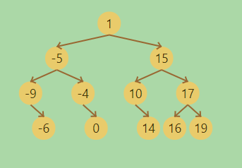

# tree-visualizer

npmの公開テスト中です。
偶然このライブラリーを見つけても使用しないでください。

tree-visualizer can visualize tree structures(BST).

tree-visualizerは木構造（二分木）の挿入や削除を可視化することができます。

木構造の表示は階層順にならべた配列を入力するだけです。

[1,-5,15,-9,-4,10,17,null,-6,null,0,null,14,16,19]



[demo](https://nori-ut3g.github.io/tree-visualizer/)
でチェックしてください。

## Getting Started

### Prerequisites
- anime.js 

### Installing

```
$ npm install treeVisualizer
```
```
$ git clone https://github.com/u3g/src/tree-visualizer.js
or
https://unpkg.com/tree-visualizer/tree-visualizer.js
```

### Usage
ES6 modules
```js
import treeVisualizer from "tree-visualizer/src/tree-visualizer.es.js";
```

Link 
```html
    <script type="text/javascript" src="https://unpkg.com/animejs@3.2.1/lib/anime.min.js"></script>
    <script type="text/javascript" src="https://unpkg.com/tree-visualizer@0.0.1/src/tree-visualizer.js"></script>

```


## Author


mail to: xxxx@mail.com

## License

"tree-visualizer" is under [MIT license](https://en.wikipedia.org/wiki/MIT_License)
